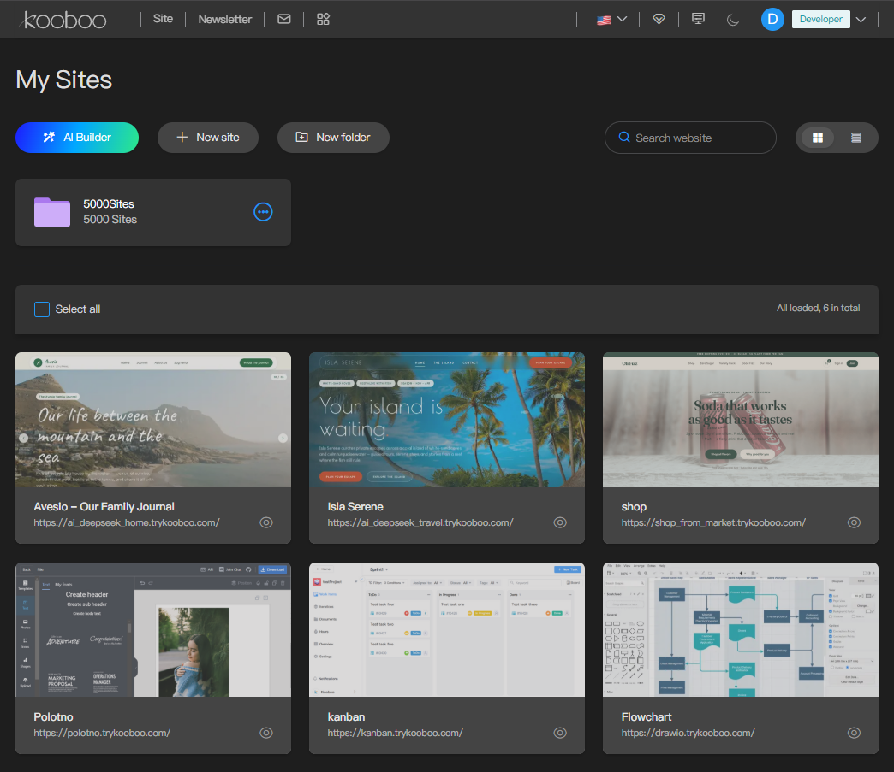

# We Served 5,000 Dynamic Websites from a 2 vCPU 4 GB Server

We created 5,000 independent Kooboo websites from one fully dynamic site package, placed them on a small Tencent Cloud server, and sent 90,000 HTTPS requests from a separate Alibaba Cloud server across the public Internet.

The Kooboo server had 2 vCPUs and 4 GB of memory. The load generator targeted 150 request starts per second for ten minutes, visited every hostname repeatedly, downloaded each complete HTML response, and verified that every response came from the correct numbered site.

The result was 89,969 verified responses and 31 connection timeouts, or a 99.97% first-attempt success rate. Kooboo's average CPU consumption was 45.6% of the machine's total two-vCPU capacity, sampled peak CPU was 81.5%, and sampled resident memory peaked at approximately 2.50 GiB.

This repository includes the test client, request-level CSV data, server monitoring records, and instructions for reproducing the test. The purpose is not to ask readers to accept a headline. It is to make the workload and its limitations inspectable.

## Result at a glance

| Measurement | Result |
|---|---:|
| Independent Kooboo sites | 5,000 |
| Planned requests | 90,000 |
| Verified successful responses | 89,969 |
| Connection timeouts | 31 |
| HTTP errors | 0 |
| Content mismatches | 0 |
| First-attempt success rate | 99.97% |
| Configured start rate | 150 requests per second |
| Measured start rate | 146.59 requests per second |
| Measured completion rate | 146.52 requests per second |
| Total elapsed time | 10 minutes 14.26 seconds |
| Complete-content p50 | 296.73 ms |
| Complete-content p95 | 1,431.27 ms |
| Complete-content p99 | 3,393.82 ms |
| Data downloaded | 1,625,360,034 bytes |
| Average network throughput | Approximately 21.2 Mbps |
| Kooboo average CPU | 45.6% of total two-vCPU capacity |
| Kooboo sampled peak CPU | 81.5% of total two-vCPU capacity |
| Kooboo sampled peak RSS | Approximately 2.50 GiB |

## What the 5,000 websites contain

These were not 5,000 static HTML files, hostname aliases, or routes pointing to one shared fallback site. A provisioning script imported one controlled website package 5,000 times, creating 5,000 separate Kooboo site instances. During creation, it assigned every instance a different site name and numbered hostname.

The distinction is important. The 5,000 sites share one Kooboo server process and one VPS, and they began with the same content, but they do not share one editable site record. Each has its own site identity and editable site data. Each site can be opened, managed, and changed independently. Editing the content, layout, views, routes, labels, or settings of one site does not edit the other 4,999 sites. "Separate" in this article means separate Kooboo sites; it does not mean 5,000 operating-system processes or 5,000 virtual machines.

| Shared by the demonstration | Separate for every website |
|---|---|
| One VPS and one Kooboo server process | Kooboo site identity and editable site record |
| The same initial source package and content | Site name and numbered hostname |
| The same measured application design | Content, pages, layouts, views, routes, labels, and settings after creation |

Each site contains:

- Ten AI-generated blog articles stored as site content
- A master layout, pages, a header view, and a footer view
- A dynamic query that retrieves the blog list for the home page
- Dynamic queries for individual blog detail pages
- URL rewriting for article routes
- Dynamic HTML titles and meta tags based on the selected article
- A responsive HTML design with custom styles and Google Fonts
- Kooboo labels and reusable HTML blocks for smaller pieces of text
- A Header View cached with Kooboo's cache-by-purpose setting

The Header View is the only part configured to use Kooboo's cache-by-purpose feature. The page, master layout, Footer View, labels, HTML blocks, and dynamic blog query are not configured with cache by purpose, and there is no full-page output cache hiding the dynamic work. The root page dynamically queries and renders ten blog entries for every request. The package also contains dynamic article-detail routes, although this particular benchmark requested only the root page. The test therefore exercises domain resolution, Kooboo site selection, routing, layout and view rendering, the uncached home-page content query, HTML generation, and response transfer. It does not exercise every detail-page route in the package.

Each clone contains its own visible marker, such as `Site 4996`. The test client checks for the expected `Site N` marker in every body. This matters because an HTTP 200 response alone cannot prove that 5,000 hostnames reached 5,000 correct site bindings.
 


Temporary Kooboo application access to this live demonstration is available to technical reviewers on request. Reviewers can edit an assigned site and observe the result directly. To request access, email [GUOQI AT Kooboo.com] with your name, technical background, and what you would like to inspect.

You can inspect public examples by changing the hostname number:

- [site1.trykooboo.com](https://site1.trykooboo.com/)
- [site1942.trykooboo.com](https://site1942.trykooboo.com/)
- [site5000.trykooboo.com](https://site5000.trykooboo.com/)

The public demonstration is a shared system and may occasionally be temporarily unavailable. A downloadable site package will also be provided so the complete experiment can be reproduced on another Kooboo installation.

## Why use the same package 5,000 times

Using one package is intentional. The creation script reproduces the same initial content and application structure, then gives each newly created site its own identity and hostname. This keeps the page structure, content volume, query shape, and response size controlled while preserving 5,000 separately editable sites. It makes the cost of multi-site routing and isolated site storage easier to observe without mixing in 5,000 unrelated application designs.

It also creates an important limitation. Identical packages can benefit from similar filesystem access patterns, warm operating-system caches and compression behavior, This result should not be interpreted as proof that any arbitrary collection of 5,000 production applications will have the same capacity.

The correct interpretation is narrower:

> One Kooboo process on this measured 2-vCPU, 4-GB server hosted 5,000 independent instances of this dynamic blog package and returned 89,969 correctly verified HTML responses during this public-Internet workload.

A future mixed-workload benchmark could divide the sites among several packages, such as content sites, commerce sites, API-backed applications, image-heavy sites, and write-heavy business applications. This controlled identical-package test is the baseline, not the final word on every possible workload.

## Test topology


The measured run began on September 5, 2026 at 12:15:51 UTC. The generator and target were not on the same intranet. Traffic crossed the public Internet from Silicon Valley to Virginia. The measured latency therefore includes client scheduling, DNS, TCP connection establishment, TLS, Internet routing, Kooboo processing, and content transfer.

This is not a pure server-render-time benchmark. It is an end-to-end HTTPS pressure test.

## Target server

| Item | Value |
|---|---|
| Provider | Tencent Cloud Lighthouse |
| Region | Virginia, USA |
| Virtualization | KVM |
| CPU allocation | 2 vCPUs |
| Reported CPU model | Intel Xeon Platinum 8255C at 2.50 GHz |
| Memory plan | 4 GB |
| Memory visible to Linux | 3,723.9 MiB |
| System disk | 60 GB |
| Network plan | 200 Mbps shared |
| Operating system | Ubuntu 24.04.4 LTS |
| Kernel | Linux 6.8.0-124-generic |
| Kooboo executable | `/home/Kooboo/Kooboo.Server` |
| Kooboo executable SHA-256 | `559477fd72fd00277990b40a2b98ec82659029850a7b3a9d473dcdbb0f49ce49` |

The Linux guest reported the virtual disk as rotational. That flag does not identify the underlying Tencent Cloud disk class, so no SSD or HDD claim is made here.

## Load-generator server

| Item | Value |
|---|---|
| Provider | Alibaba Cloud ECS |
| Region | US Silicon Valley |
| Instance type | `ecs.c9i.xlarge` |
| CPU allocation | 4 vCPUs |
| Reported CPU model | Intel Xeon 6982P-C |
| Memory plan | 8 GiB |
| Memory visible to Linux | 7.1 GiB |
| System disk | 40 GB Alibaba Cloud Elastic Block Storage |
| Guest disk type | NVMe, non-rotational |
| Network limit | 100 Mbps |
| Operating system | Ubuntu 26.04 LTS |
| Kernel | Linux 7.0.0-29-generic |
| Open-file limit | 65,535 |
| Swap | None |

The generator used approximately 559 MiB of system memory before the run and 567 MiB afterward. The raw records did not include one-second CPU sampling for the generator, so no generator peak-CPU claim is made.

## The open test client

`kooboo-stress` is a standalone C# command-line client targeting .NET 10. It is designed to be publishable as a self-contained Windows or Linux executable, so the test machine does not need a separate .NET installation.

The project declares AOT compatibility and enables trimming analysis. The source is included in this repository so readers can inspect the scheduling, HTTP handling, body verification, aggregation, and result-writing logic.

The public build has two modes:

- `sweep` requests every numbered site once and can retry failures. Its purpose is binding and correctness verification.
- `stress` repeatedly requests the selected site range for a fixed duration. It does not retry, because retries would conceal first-attempt errors and change the offered load.

Running the executable without arguments starts a guided test and asks only for:

1. Multiple domains or one domain
2. Requests per second
3. Duration in minutes

The public client limits guided and command-line runs to 200 request starts per second and 20 minutes. This is only a client-side safety guard. It does not replace authorization, target-side rate limiting, or operational monitoring. Only test infrastructure that you own or are explicitly permitted to test.

## Exact workload used

| Setting | Value |
|---|---|
| Mode | Timed stress test |
| Site range | `site1` through `site5000` |
| Selection | Sequential |
| Configured rate | 150 starts per second |
| Requested duration | 10 minutes |
| Planned requests | 90,000 |
| Maximum active requests | 300 |
| Overall HTTP request timeout | 30 seconds |
| TCP connection timeout | 10 seconds |
| Idle connection retention | 1 second |
| Page caching | Header View uses cache by purpose; remaining tested page is uncached |
| Content verification | `Site {0}` |
| Retries | None |
| Redirects | Enabled |
| Decompression | Enabled |
| Response body | Completely downloaded |

The scheduler places request starts at evenly spaced intervals. When the process is late, it schedules the next start relative to the actual start instead of emitting a catch-up burst. This protects the target from accidental bursts but means the measured rate can be slightly below the configured rate.

In this run, 90,000 requests were dispatched at an average of 146.59 starts per second rather than exactly 150. The complete run lasted 10 minutes 14.26 seconds.

## A deliberately connection-heavy test

There are 5,000 hostnames and 150 request starts per second. One complete sequential pass takes approximately 33.3 seconds, so each hostname is revisited about once every 33 seconds.

The client releases connections after one second of idleness to avoid retaining thousands of idle hostname connections. As a result, most requests cannot reuse the previous connection for that hostname. The workload therefore produces a high rate of DNS lookups and new TCP and TLS connection establishment in addition to dynamic HTML requests.

This is harsher than repeatedly requesting one popular domain over a warm connection. It also resembles traffic distributed across many low-volume sites where each request may come from a different visitor.

For comparison, an earlier single-domain control test reached approximately 198 requests per second with 24,000 of 24,000 successful responses and p95 content latency of about 67.5 ms. The difference demonstrates how strongly connection reuse and network path behavior affect an end-to-end multi-domain result.

## How correctness was verified

For request number `N`, the client:

1. Selected a numbered hostname.
2. Sent an HTTPS request and waited for response headers.
3. Downloaded the complete decompressed response body.
4. Checked the HTTP status.
5. Searched the response bytes for the expected `Site N` marker.
6. Recorded timing, byte count, protocol, status, and any error in CSV format.

This distinguishes three conditions that would otherwise all look like traffic:

- The correct site returned successfully.
- A server returned an HTTP error.
- A hostname returned HTTP 200 but resolved to the wrong site or fallback content.

All 89,969 successful responses passed the site-number content check. All used HTTP/2.

## Complete results

```text
Requests: 90,000 | OK: 89,969 (99.97%) | failed: 31
Target: 150 starts/s | actual starts: 146.59/s | completed: 146.52/s
Sites touched: 5,000 | max active requests: 300/300
Timeout: 31 | network: 0 | HTTP: 0 | content mismatch: 0 | other: 0
Data read: 1,550.06 MiB | elapsed: 00:10:14
[HEADERS] avg 527.7 ms | p50 294.9 ms | p95 1,376.2 ms | p99 3,329.4 ms | max 11,103.5 ms
[CONTENT] avg 537.4 ms | p50 296.7 ms | p95 1,431.3 ms | p99 3,393.8 ms | max 11,575.0 ms
```

| Timing | Minimum | Average | p50 | p95 | p99 | Maximum |
|---|---:|---:|---:|---:|---:|---:|
| Response headers | 189.59 ms | 527.67 ms | 294.88 ms | 1,376.20 ms | 3,329.37 ms | 11,103.53 ms |
| Complete content | 189.62 ms | 537.39 ms | 296.73 ms | 1,431.27 ms | 3,393.82 ms | 11,575.04 ms |

The HTML bodies totalled 1,625,360,034 bytes. Average payload size was approximately 17.6 KiB per successful response. Across the complete run, average payload throughput was approximately 21.2 Mbps, far below both the generator's 100 Mbps limit and the target's 200 Mbps plan.

## Target CPU analysis

Linux `top` sampled the Kooboo process once per second throughout the measured workload. On Linux, one process can report up to 200% CPU on a two-vCPU machine. The table therefore includes both the process value and its equivalent percentage of total machine capacity.

| CPU measurement | Kooboo process value | Share of total two-vCPU capacity |
|---|---:|---:|
| Average | 91.3% | 45.6% |
| p50 | 92.0% | 46.0% |
| p95 | 114.0% | 57.0% |
| p99 | 133.0% | 66.5% |
| Maximum sample | 163.0% | 81.5% |

Whole-system CPU usage averaged 47.0%, reached p95 at 59.4%, and had a maximum one-second sample of 82.4%. Average I/O wait was 0.09%, maximum I/O wait was 2.6%, and reported CPU steal remained at zero.

The server therefore retained CPU headroom during the measured run. This does not prove unlimited scaling, but it does show that sustained CPU saturation was not the cause of the 31 failures.

## Target memory analysis

| Memory measurement | Value |
|---|---:|
| Kooboo RSS immediately before the run | 2,481,924 KiB, approximately 2.37 GiB |
| Highest sampled memory percentage | 68.8% |
| Approximate highest sampled RSS | 2.50 GiB |
| Kooboo RSS after the run | 2,523,268 KiB, approximately 2.41 GiB |
| Net RSS change | Approximately 40.4 MiB |
| Process swap before | 520,592 KiB, approximately 508.4 MiB |
| Process swap after | 524,216 KiB, approximately 511.9 MiB |
| System swap before | Approximately 643.1 MiB |
| System swap after | Approximately 643.2 MiB |
| Threads before and after | 16 |

The process had already reached a historical RSS high-water mark of approximately 2.69 GiB before this benchmark, because the server had been running for more than five hours and had handled earlier tests. That high-water mark did not increase during this run.

The machine also had pre-existing swapped pages. Process swap increased by only about 3.5 MiB and whole-system swap remained effectively unchanged. Combined with 0.09% average I/O wait, the records do not show active swap pressure limiting this test.

## What caused the 31 failures

The request-level CSV makes the failure pattern unusually clear:

- All 31 failures received no HTTP status.
- All recorded zero milliseconds to response headers.
- Every failure ended between 10,000.101 and 10,082.277 ms.
- Every error was `Request timed out`.
- The failed requests belonged to 31 different site numbers.
- No site failed more than once.
- Every affected site succeeded during its other 17 visits.
- The failures appeared in short bursts rather than accumulating steadily.

The client has two timeout layers. The overall `HttpClient` request timeout is 30 seconds, but `SocketsHttpHandler.ConnectTimeout` is capped at 10 seconds. The exact ten-second duration and absence of response headers identify these as connection-establishment timeouts before an HTTP response was received.

This does not prove which device or network hop dropped or delayed each connection. The possible path includes the generator, its DNS resolver, Alibaba Cloud networking, the public route between Silicon Valley and Virginia, Tencent Cloud networking, and the target listener. What the records do show is that these were not HTTP 500 responses, incorrect site responses, or dynamic pages that took 30 seconds to render.

At the times failures were reported, Kooboo process CPU samples ranged roughly from 55% to 114% in Linux `top`, against a two-vCPU maximum of 200%. The server was not continuously saturated around the failure periods.

The 31 failures equal 0.0344% of attempts, or approximately one connection timeout per 2,903 requests. There were no retries in stress mode, so 99.97% is the raw first-attempt result rather than a retry-adjusted number.

## Did the 300-request concurrency ceiling distort the result

The run reported a maximum of 300 active requests against a configured maximum of 300. Looking only at that final line could suggest sustained client throttling, but the second-by-second record provides more context:

- Active requests averaged approximately 78.4.
- The ceiling of 300 was reached for two seconds during the initial cold connection ramp.
- Active requests were at or above 250 for only four seconds.

The ceiling affected the startup burst but was not a sustained limit throughout the ten-minute workload. Latency waves still caused active-request counts to rise periodically, which is expected when many new connections are being established across a public network.

## What this benchmark demonstrates

The records support the following statements:

- One Kooboo server process hosted 5,000 independently addressable and independently editable site instances.
- A script created each site separately from the same package and assigned a distinct site name and hostname.
- The tested sites were dynamic blog sites, not static placeholder files.
- Only the Header View used cache by purpose; the dynamic blog-list query and the rest of the tested page were not served from a full-page cache.
- Every successful response was checked for the correct site-specific marker.
- The generator attempted 90,000 complete HTML requests across all 5,000 hostnames.
- Kooboo returned 89,969 correct HTTP/2 responses.
- The first-attempt success rate was 99.97%.
- The measured start rate was 146.59 requests per second.
- The Tencent 2-vCPU, 4-GB target retained CPU headroom.
- The measured network throughput remained well below the advertised limits.
- No HTTP errors or content-routing errors were observed.

## What this benchmark does not demonstrate

The records do not prove that:

- Every possible collection of 5,000 production sites fits on the same server.
- A 2-vCPU server can sustain arbitrary traffic beyond this measured workload.
- Browser page load is 296 ms. The client did not execute JavaScript or download browser-discovered images, stylesheets, or fonts.
- The 31 connection timeouts originated inside one specific provider.
- Future runs will always produce the same success rate.
- A shared public demo will always be available.
- Identical cloned sites represent a diverse production workload.

These boundaries are part of the result, not qualifications to hide in small print.

## Reproduce the test

Only run the tool against systems you own or are authorized to test.

### Guided mode

On Linux:

```bash
chmod +x kooboo-stress
./kooboo-stress
```

On Windows:

```bat
kooboo-stress.exe
```

Choose:

```text
Test target: 1
Requests per second: 150
Test duration in minutes: 10
```

The program prints progress every second and writes `summary.txt` and `stress-requests.csv` under `results/<UTC timestamp>`.

### Exact command-line equivalent

```bash
./kooboo-stress \
  --mode stress \
  --first-site 1 \
  --last-site 5000 \
  --rps 150 \
  --duration 10m \
  --timeout 30s \
  --max-concurrency 300 \
  --selection sequential \
  --expect "Site {0}"
```

### Verify every site once before applying pressure

```bash
./kooboo-stress \
  --mode sweep \
  --sites 5000 \
  --rps 10 \
  --expect "Site {0}"
```

Sweep mode can retry failed sites and reports which failures recovered. Stress mode intentionally does not retry.

## Downloads and raw records

The complete benchmark evidence and reproduction materials can be downloaded directly from this repository.

Benchmark evidence:

- [Target server information and CPU monitoring](5000-sites-benchmark/final150-target-results.tar.gz)
- [Load-generator information and console output](5000-sites-benchmark/final150-loadgen-results.tar.gz)
- [Request-level CSV and exact summary](5000-sites-benchmark/final150-detailed-results.tar.gz)
- [SHA-256 checksums for the benchmark archives](5000-sites-benchmark/BENCHMARK_SHA256SUMS.txt)

Site package and test tools:

- [Kooboo dynamic-site package](5000-sites-benchmark/kooboo-5000-dynamic-sites.zip) - importable into another Kooboo instance
- [Linux x64 stress-test client](5000-sites-benchmark/kooboo-stress-linux-x64.tar.gz) - self-contained command-line application
- [Windows x64 stress-test client](5000-sites-benchmark/kooboo-stress-win-x64.zip) - self-contained command-line application
- [C# source code](5000-sites-benchmark/kooboo-stress-source.zip) - test-client source and publishing scripts
- [Package README](5000-sites-benchmark/README.txt) - contents, commands, and safety notice
- [SHA-256 checksums for all downloadable artifacts](5000-sites-benchmark/SHA256SUMS.txt)

## Independent inspection

Readers do not need administrative access to inspect the public sites or run the downloadable client. The numbered hosts are public, and the raw CSV contains one row for every request.

For people who want to inspect how the sites are stored, queried, edited, and routed inside Kooboo, temporary Kooboo application access can be provided on request. This is not root or operating-system access. A reviewer can edit one selected site's content and immediately see that site's output change without changing the other 4,999 sites.

To request access, email the project owner from a work or organization domain and include your name, organization or public professional profile, technical background, reason for requesting access, and what you plan to inspect. Independent developers or researchers without a company domain can provide an established GitHub or professional profile instead. This identity check is intended to protect a shared public demonstration, not to collect unnecessary personal information.

Access is temporary, individually issued, limited to the necessary Kooboo permissions, and restricted to an agreed review window. Reviewers must agree not to share credentials, attempt privilege escalation, run unapproved security or load tests, disrupt other reviewers, or retain/export non-public server data. The publicly downloadable demonstration package and benchmark records may of course be retained. The restriction applies to temporary credentials, continued access after the review window, and non-public material on the shared server.

Credentials are not published in this repository. Each reviewer should receive a separate account for a selected disposable demo site, not a shared administrator password. Accounts should expire automatically or be revoked after the agreed review period. The selected site can then be restored from the public package, and credentials should be rotated if there is any concern about disclosure. The shared demonstration may occasionally be unavailable while it is reset, updated, or protected from excessive concurrent testing.

A concise access request can use this format:

```text
Subject: Kooboo 5,000-site demo access request

Name:
Organization and work email, or public professional profile:
Technical background:
What I want to verify:
Requested review period:

I agree to use only the account and site assigned to me; not share credentials;
not run security or load tests without written permission; not disrupt the shared
service; and not retain or export non-public server data. I understand that the
account will expire after the agreed review period.
```

This agreement intentionally does not prohibit retaining the public site package, source code, or benchmark records.

## What I would test next

This experiment establishes a reproducible baseline. The next useful tests are not simply larger numbers. They should change one workload dimension at a time:

1. A mixed set of dynamic site packages rather than 5,000 identical clones
2. Blog-detail URLs in addition to the root list page
3. API and database-write workloads
4. Static image and file delivery measured separately
5. Cold restart versus warm-cache behavior
6. A same-region generator to separate Internet-route latency from server capacity
7. Long-duration memory and resource stability
8. Publication and editing activity while read traffic continues

If you reproduce the test, please publish the exact server specifications, region, tool version, command line, raw summary, request CSV, CPU and memory records, and any modifications to the site package. Comparable data is more valuable than a larger unsupported headline.

## Closing

The interesting result is not that a server returned one fast page. It is that one Kooboo process on a modest 2-vCPU, 4-GB public cloud server selected among 5,000 separately created and independently editable dynamic sites, executed their uncached home-page content queries, rendered the correct site-specific HTML, and returned 89,969 verified responses while retaining measurable CPU headroom. Only the Header View used cache by purpose; the benchmark did not rely on a full-page cache.

The remaining 31 failures are visible in the raw data. They were ten-second connection-establishment timeouts with no HTTP response, not hidden retries or incorrect content. That distinction is why the records and test client are being published together with the claim.
