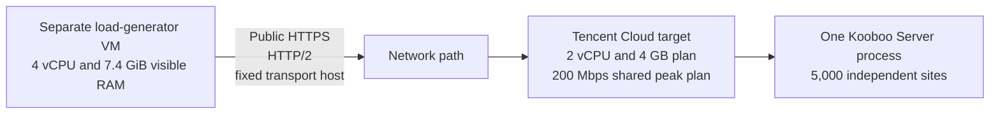

# Kooboo Dynamic Page Rendering Under 0.5 ms on 5,000 Sites

**98.3% of 200,000 verified renders completed in less than 0.5 milliseconds on a 2-vCPU, 4-GB server.**

Every request rendered a dynamic home page that queried and displayed ten blog items. The page itself had no page cache or full-page output cache enabled; only its reusable Header View used Kooboo's cache-by-purpose feature. This distinction is important: the result did not come from returning an already cached complete HTML page.

Kooboo served the 200,000 correctly verified warm-render requests across 5,000 independent sites. Of those renders, 196,609, or 98.3045%, completed in less than 0.5 milliseconds. The benchmark used two controlled runs: 100,000 measured requests with one closed-loop worker and another 100,000 with two workers.

Across the combined dataset, 198,002 of 200,000 server renders completed in less than 1 millisecond. Using the benchmark client's nearest-rank percentile method, combined server-render latency was 0.306 ms at p50, 0.443 ms at p95, and 0.991 ms at p99. Every measured request returned HTTP 200, matched the expected per-site body marker, included all required server-timing values, and completed without a timeout or network error.

This is a benchmark of Kooboo's prepared, warm server-render path. It is not a claim that every request completes in 1 ms, that 5,000 sites are rendered simultaneously, or that public-Internet response time is below 1 ms. Network-inclusive response timings are reported separately.

Download the benchmark client, the tested 10-blog site package, and the evidence:

- [Windows x64 benchmark client](kooboo-under-1ms/kooboo-under-1ms-render-benchmark-client-win-x64.zip?raw=true)
- [Linux x64 benchmark client](kooboo-under-1ms/kooboo-under-1ms-render-benchmark-client-linux-x64.tar.gz?raw=true)
- [Dynamic 10-blog Kooboo site package](kooboo-under-1ms/kooboo-5000-dynamic-sites.zip?raw=true)
- [Target-server monitoring and environment evidence](kooboo-under-1ms/kooboo-1ms-target-report.tar.gz?raw=true)
- [Load-generator results and request-level CSV data](kooboo-under-1ms/kooboo-1ms-loadgen-report.tar.gz?raw=true)

The downloadable site package is the same source package used to provision all 5,000 sites in the earlier capacity benchmark. Kooboo Server is not bundled with these benchmark downloads; use the [latest Kooboo release](https://github.com/Kooboo/Kooboo/releases/latest).

## Result at a glance

| Measurement | Result |
|---|---:|
| Independent Kooboo sites | 5,000 |
| Page workload | Dynamic query rendering 10 blog items |
| Page cache | Disabled; no full-page output cache |
| Warm-up requests | 10,000 total, 5,000 per run |
| Measured requests | 200,000 total, 100,000 per run |
| Measurements per site | 20 per run, 40 combined |
| Successful verified responses | 200,000 / 200,000 |
| HTTP errors | 0 |
| Timeouts or network errors | 0 |
| Content mismatches | 0 |
| Missing or invalid timing headers | 0 |
| Server renders below 0.5 ms | 196,609 / 200,000, or 98.3045% |
| Server renders below 1 ms | 198,002 / 200,000, or 99.001% |
| Combined render average | 0.397 ms |
| Combined render p50 | 0.306 ms |
| Combined render p95 | 0.443 ms |
| Combined render p99 | 0.991 ms |
| Complete decompressed content | 3,613,155,720 bytes |
| HTTP protocol | HTTP/2 for all 200,000 requests |

The combined values pool the two equal-sized runs. The per-run results below remain the primary comparison because they show how the latency tail changed when the worker count increased.

## Server-render results by worker count

| Workers | Requests | Success | Below 1 ms | Average | p50 | p95 | p99 | Maximum |
|---:|---:|---:|---:|---:|---:|---:|---:|---:|
| 1 | 100,000 | 100.00% | 99.07% | 0.390 ms | 0.309 ms | 0.445 ms | 0.671 ms | 661.017 ms |
| 2 | 100,000 | 100.00% | 98.93% | 0.405 ms | 0.302 ms | 0.441 ms | 1.347 ms | 641.987 ms |
| Combined | 200,000 | 100.00% | 99.001% | 0.397 ms | 0.306 ms | 0.443 ms | 0.991 ms | 661.017 ms |

The median and p95 render times were effectively unchanged at two workers. The worker-2 p99 crossed 1 ms because a small upper-tail group became slower, even though 98.93% of that run still completed below 1 ms. The report therefore does not claim that every tested concurrency level achieved a sub-millisecond p99.

### Render-latency distribution

| Range | 1 worker | 2 workers |
|---|---:|---:|
| Below 0.5 ms | 98,491 | 98,118 |
| Below 1 ms | 99,070 | 98,932 |
| 2 ms or slower | 889 | 942 |
| 5 ms or slower | 722 | 762 |
| 10 ms or slower | 40 | 276 |
| 100 ms or slower | 2 | 2 |

No samples were removed or winsorized. The reported averages, percentiles, and maxima include the long-tail observations. Each run contained two render stalls above 600 ms. Because the p50 and p95 remained close to 0.3 ms and 0.44 ms, these rare stalls affect the maximum and average much more than the typical request.

## What was timed

The instrumented server returns three values in the standard `Server-Timing` response header:

| Metric | Measurement boundary |
|---|---|
| `kooboo-engine` | Execution of the already prepared render plan by `KoobooEngine.Execute` |
| `kooboo-render` | Render-output setup, source-data attachment, plan lookup, and render-engine execution |
| `kooboo-app` | Kooboo request-context start until response writing begins |

An observed response header was:

```http
HTTP/2 200
server: Kooboo 3.0.9753
content-encoding: zstd
server-timing: kooboo-render;dur=0.288, kooboo-engine;dur=0.281, kooboo-app;dur=0.398
isonlineserver: True
```

The timing is generated with `Stopwatch.GetTimestamp()` and converted using `Stopwatch.Frequency`. Durations are formatted in milliseconds to three decimal places with invariant culture.

The timer ends before `WritePageResponse` transfers the response. It therefore excludes DNS, TCP, TLS, Internet routing, response compression and transmission, and client-side body download. Those operations are represented only by the separately recorded response-header and complete-content timings.

Full-page cache hits do not execute this instrumented render path and intentionally omit these metrics. The client treats a missing or invalid `Server-Timing` header as a failed measurement. All 200,000 measured responses returned valid `kooboo-render`, `kooboo-engine`, and `kooboo-app` values, so full-page cache hits could not silently enter the successful render dataset.

## Workload and correctness controls

The benchmark used the same 5,000-site dataset documented in the separate [5,000-site capacity benchmark](BENCHMARK.md). The sites are separately addressable Kooboo site instances created from the downloadable [dynamic 10-blog site package](kooboo-under-1ms/kooboo-5000-dynamic-sites.zip). This keeps page structure, query shape, content volume, and response size consistent while exercising 5,000 separate site identities and host bindings.

The requested root page dynamically queries and renders ten blog entries and uses a master layout, views, labels, and reusable HTML blocks. The page cache and full-page output cache were disabled. Only the Header View uses Kooboo's cache-by-purpose feature. Successful timing validation provides an additional guard against a full-page cache hit entering this dataset.

Before each measured run, the client sent one warm-up request to every site. All 5,000 warm-ups succeeded in both runs. The measured phase then selected sites sequentially, wrapping from site 5,000 back to site 1. Exactly 20 measured requests reached every site in each run.

The client used fixed closed-loop workers. Each worker waited for its complete response body before starting its next request. This design holds concurrency at a controlled level, but it also means public-network latency limits the request completion rate. It is a latency benchmark at the stated worker counts, not an open-loop server-throughput saturation test.

For every request, the client:

1. Connected to `https://site1.trykooboo.com/` with HTTPS and valid TLS/SNI.
2. Set the HTTP `Host` header to the required `site{N}.trykooboo.com` binding.
3. Waited for response headers and parsed all three Kooboo server-timing values.
4. Downloaded and decompressed the complete response body.
5. Required a successful HTTP status.
6. Searched the body for the expected `Site N` marker.
7. Recorded the site, worker, status, timing values, protocol, byte count, and any failure in request-level CSV output.

Using one transport URL deliberately avoids turning this render benchmark into a 5,000-host DNS, TCP, and TLS connection benchmark. Kooboo still routes every request through the numbered `Host` header. Redirects were disabled for this fixed-host mode, automatic decompression was enabled, proxies and cookies were disabled, and requests asked for HTTP/2 with fallback to a lower version. All successful requests negotiated HTTP/2.

The decompressed response bodies ranged from 18,063 to 18,066 bytes. Each run downloaded 1,806,577,860 bytes, for a combined total of 3,613,155,720 bytes.

## Test topology



The target and load generator were separate machines, so the client did not consume the target's two CPU cores. Traffic used the public HTTPS endpoint. The render metric itself came from the target's server clock; the client-side header and complete-content values include the network path.

## Target server

| Item | Value |
|---|---|
| Provider and product | Tencent Cloud Lighthouse |
| CPU allocation | 2 vCPUs |
| Reported CPU model | Intel Xeon Platinum 8255C at 2.50 GHz |
| Memory plan | 4 GB |
| Memory visible to Linux | 3.6 GiB |
| System disk | 60 GB |
| Network plan | 200 Mbps shared peak bandwidth |
| Operating system | Ubuntu 24.04.4 LTS |
| Kernel | Linux 6.8.0-124-generic |
| Virtualization | KVM |
| Kooboo version header | Kooboo 3.0.9753 |
| Kooboo executable | `/home/Kooboo/Kooboo.Server` |
| Kooboo executable SHA-256 | `124fab6a6daf0e430c8fa97b8cd79558c39b51b845fa6725e86f320be358273e` |
| Instrumentation source commit | `b50c7505f758d634a945ccccf71bcd50c5ce5f2e` |

## Load-generator server

| Item | Value |
|---|---|
| CPU allocation | 4 vCPUs |
| Reported CPU model | AMD EPYC 9754 |
| Memory visible to Linux | 7.4 GiB |
| Operating system | Ubuntu 26.04 LTS |
| Kernel | Linux 7.0.0-14-generic |
| Virtualization | KVM |
| Swap used at evidence collection | 0 bytes |
| Client executable SHA-256 | `0f73fddcf6a3b3e8b265e069d17f54d23ba3e378e62a6901b1896cfd6a86cf26` |

The supplied snapshot did not record the load generator's cloud provider, exact region, disk configuration, or network plan, so this report does not assign values to them.

## Target resource use

The target was sampled once per second with `pidstat` and `vmstat`. The table below restricts the calculations to the measured request windows and excludes the preceding warm-up period.

| Measurement | 1 worker | 2 workers |
|---|---:|---:|
| Measurement duration | 50:00.56 | 36:50.08 |
| Total-system CPU busy, average | 14.3% | 17.7% |
| Total-system CPU busy, p95 | 23% | 36% |
| Total-system CPU busy, p99 | 30% | 41% |
| Total-system CPU busy, sampled maximum | 56% | 62% |
| Kooboo process CPU, average | 26.2% of one CPU | 33.2% of one CPU |
| Equivalent share of total two-vCPU capacity | 13.1% | 16.6% |
| Kooboo sampled RSS, minimum | 1.931 GiB | 1.899 GiB |
| Kooboo sampled RSS, average | 2.023 GiB | 1.939 GiB |
| Kooboo sampled RSS, maximum | 2.143 GiB | 1.984 GiB |
| System I/O wait, average | 0.14% | 0.11% |
| System I/O wait, sampled maximum | 18% | 2% |
| Hypervisor steal, sampled maximum | 0% | 0% |
| Swap-in during measured window | Approximately 3.6 MiB | Approximately 1.9 MiB |
| Swap-out during measured window | 12 KiB | 0 KiB |

Linux `pidstat` allows a process to report up to 200% CPU on this two-vCPU machine. The equivalent-capacity row divides the process figure by two. The `vmstat` total-system figures are easier to compare with cloud dashboards because they already represent the whole machine.

The server had about 821 MiB of system swap in use when the final environment snapshot was collected, and the Kooboo process reported about 435 MiB in `VmSwap`. However, measured swap traffic was small and there was no sustained swap-out activity during either run. The process lifetime high-water RSS was 2.418 GiB; that value spans the process lifetime and is not attributed to either individual run.

The target was not CPU saturated, showed no hypervisor steal, and spent very little time waiting for disk I/O during these low-concurrency runs.

## Render-engine and application timings

| Run | Metric | Average | p50 | p95 | p99 | Maximum |
|---|---|---:|---:|---:|---:|---:|
| 1 worker | Prepared render engine | 0.383 ms | 0.303 ms | 0.437 ms | 0.642 ms | 661.012 ms |
| 1 worker | Application to response-write start | 0.510 ms | 0.422 ms | 0.581 ms | 1.208 ms | 661.128 ms |
| 2 workers | Prepared render engine | 0.398 ms | 0.296 ms | 0.434 ms | 1.254 ms | 641.979 ms |
| 2 workers | Application to response-write start | 0.518 ms | 0.407 ms | 0.573 ms | 2.409 ms | 642.113 ms |
| Combined | Prepared render engine | 0.390 ms | 0.299 ms | 0.436 ms | 0.962 ms | 661.012 ms |
| Combined | Application to response-write start | 0.514 ms | 0.415 ms | 0.577 ms | 2.030 ms | 661.128 ms |

The small difference between `kooboo-engine` and `kooboo-render` shows that render-output setup and prepared-plan lookup contributed only a few microseconds to the typical measured request. The broader `kooboo-app` metric includes request work before rendering and the transition toward response writing, so its upper tail is higher.

## Network-inclusive results

| Workers | Timing | Average | p50 | p95 | p99 | Maximum |
|---:|---|---:|---:|---:|---:|---:|
| 1 | Response headers | 29.908 ms | 15.677 ms | 79.893 ms | 157.432 ms | 1,623.862 ms |
| 1 | Complete content | 30.002 ms | 15.764 ms | 79.964 ms | 157.594 ms | 1,624.154 ms |
| 2 | Response headers | 44.056 ms | 16.042 ms | 102.727 ms | 641.839 ms | 6,384.355 ms |
| 2 | Complete content | 44.199 ms | 16.153 ms | 102.835 ms | 645.033 ms | 6,384.406 ms |
| Combined | Response headers | 36.982 ms | 15.852 ms | 90.204 ms | 243.251 ms | 6,384.355 ms |
| Combined | Complete content | 37.100 ms | 15.949 ms | 90.317 ms | 243.723 ms | 6,384.406 ms |

The client completed 33.33 requests per second with one worker and 45.25 per second with two. These are closed-loop public-network completion rates, not Kooboo render-throughput limits. A worker cannot begin its next request until the previous complete body arrives, so round-trip latency, HTTP/2 connection behavior, shared public networking, and response delivery directly limit these figures.

The contrast between sub-millisecond server rendering and much larger response-header latency is why the report keeps server and network measurements separate.

## Reproduction commands

The following commands reproduce the recorded configuration. The expected body marker is written explicitly even though `Site {0}` is also the render-mode default.

### One worker

```bash
./kooboo-stress \
  --mode render \
  --sites 5000 \
  --requests 100000 \
  --workers 1 \
  --warmup-per-site 1 \
  --url-template "https://site1.trykooboo.com/" \
  --host-template "site{0}.trykooboo.com" \
  --expect "Site {0}" \
  --output ./results/render-official-w1
```

### Two workers

```bash
./kooboo-stress \
  --mode render \
  --sites 5000 \
  --requests 100000 \
  --workers 2 \
  --warmup-per-site 1 \
  --url-template "https://site1.trykooboo.com/" \
  --host-template "site{0}.trykooboo.com" \
  --expect "Site {0}" \
  --output ./results/render-official-w2
```

The request timeout was 30 seconds. Percentiles use the nearest-rank definition: `ceil(percentile × sample count) - 1` in the zero-based sorted sample array.

## Interpretation and defensible claim

The strongest result from an individual run is:

> Across 5,000 warmed Kooboo sites on a 2-vCPU, 4-GB server, a one-worker run completed 100,000 of 100,000 verified requests successfully, with server-render p50 of 0.309 ms, p95 of 0.445 ms, p99 of 0.671 ms, and 99.07% of renders below 1 ms.

The combined result can be stated as:

> Across two controlled one- and two-worker runs, 198,002 of 200,000 verified warm server renders across 5,000 Kooboo sites completed below 1 ms on a 2-vCPU, 4-GB server. Combined server-render p99 was 0.991 ms, while the individual two-worker p99 was 1.347 ms.

A shorter headline that retains the essential scope is:

> 98.3% of 200,000 verified warm renders across 5,000 Kooboo sites completed in under 0.5 ms on a 2-vCPU, 4-GB server.

Avoid shortening this to "5,000 sites rendered in 1 ms." The benchmark rendered one requested page at a time per worker, rotating across 5,000 warmed site instances.

## Limitations

- The sites began from one controlled package. This improves comparability but does not represent every possible production application, database size, extension, or traffic mix.
- The benchmark measures a warm prepared-plan path after one warm-up request per site. It does not measure first-request cold start, site creation, cache construction, application restart, or operating-system cold-cache behavior.
- The one- and two-worker runs are low-concurrency latency tests, not a maximum-throughput or capacity test.
- The client reused one HTTPS transport origin and changed the `Host` header for Kooboo site routing. This intentionally reduces DNS, TCP, and TLS churn and should not be described as a 5,000-domain browser workload.
- Traffic still crossed a public HTTPS path. Server render durations come from the target clock, while response-header and body timings include public-network effects.
- The target used shared cloud infrastructure and a shared 200-Mbps peak network plan. Results on another host can differ with CPU generation, hypervisor scheduling, storage, memory pressure, build, application content, and network conditions.
- Rare render stalls above 600 ms occurred in both runs and are included in the data. This benchmark identifies them but does not establish their cause.
- An exploratory eight-worker run encountered response-path timeouts and was excluded from the official result. This report makes no claim about successful eight-worker performance.
- No comparison with another framework or product was performed, so this report supports no cross-product speed claim.

## Evidence and reproducibility

The evidence package contains request-level CSV data, console output, per-run summaries, one-second target monitoring, server environment details, and executable hashes.

| Artifact | SHA-256 |
|---|---|
| `kooboo-under-1ms-render-benchmark-client-win-x64.zip` | `4c9472b5195320d47aa8d7103ea31364f2cf55adaafc94f601f64c0c5d5bff25` |
| `kooboo-under-1ms-render-benchmark-client-linux-x64.tar.gz` | `b070e5ae139f22598cb4bb5ae56115e76be861c3c4ad19ff31e048bfe87ef205` |
| `kooboo-5000-dynamic-sites.zip` | `cc7f70b1c5bb4c919d834bfbe31e9ec960c2aa70e249189716f5048b61eae0b8` |
| `kooboo-1ms-target-report.tar.gz` | `83dbb427206f564bd2dfdb9ef5a0fc0c858ba91b38f79656fa6ce8ec8e8488fc` |
| `kooboo-1ms-loadgen-report.tar.gz` | `2ad26c084bf95aa22cb6db51a3c877e3c590a0f713b9ffd621aa33d59edf0f1a` |
| Deployed `Kooboo.Server` | `124fab6a6daf0e430c8fa97b8cd79558c39b51b845fa6725e86f320be358273e` |
| Linux `kooboo-stress` client | `0f73fddcf6a3b3e8b265e069d17f54d23ba3e378e62a6901b1896cfd6a86cf26` |

The Windows download is a self-contained NativeAOT executable. The Linux download is self-contained, single-file, trimmed, and ReadyToRun. Neither package requires a separately installed .NET runtime. Kooboo Server is deliberately not included because readers can use the latest official release.

The timing instrumentation is in commit `b50c7505f758d634a945ccccf71bcd50c5ce5f2e`. The benchmark-client source records complete bodies without retaining them, uses pooled buffers, validates timing fields without reflection, and remains compatible with NativeAOT publishing.
